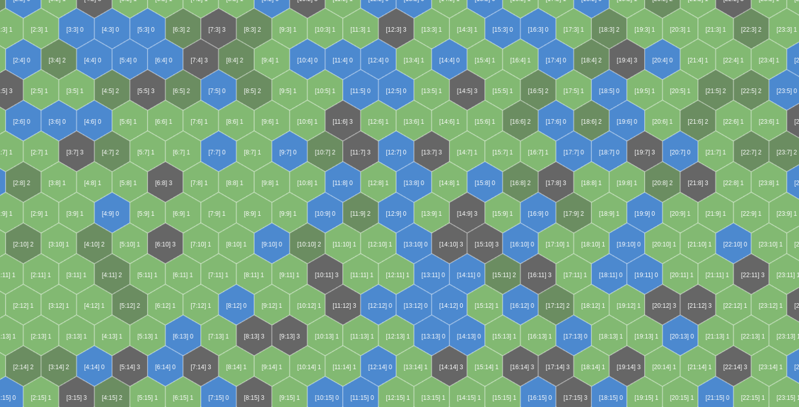

# STELLAR

## An hex-tile map exploration

Current preview

### Roadmap

-   [x] add readme file
-   [x] simplify `<PixiBoardRenderer>`
-   [x] add eslint
-   [x] add prettier
-   [ ] add unit tests
-   [ ] map exploration with drag and drop
-   [ ] map exploration with minimap
-   [ ] add a player
-   [ ] handle walkable characteristic

### Available commands

#### Installation

`yarn`

#### Development

`yarn dev`
